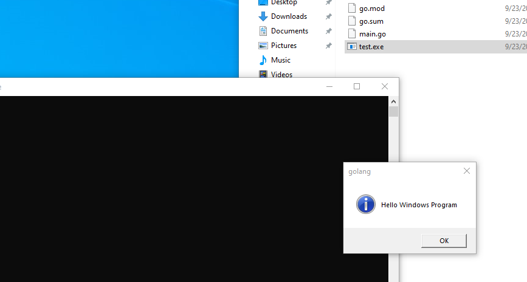
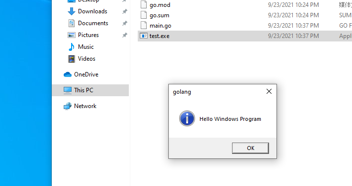

# closecmdpopup
📦 #mod# 关闭 CMD 弹窗，适用于 Go 制作的 exe 程序。

<br>

# 快速开始

写一个简单的 Windows 测试窗口程序，这里使用 dlgs 库用于简单演示。

<br>

```go
package main

import (
    "github.com/gen2brain/dlgs"

    // 添加这一行代码就可以实现关闭 CMD 窗口
    _ "github.com/matsuwin/closecmdpopup"
)

func main() {
    _, _ = dlgs.Info("golang", "Hello Windows Program")
}
```

<br>

**前后效果截图**

<br>




<br>

## 第二种方案

要禁用 Windows 的 CDM 窗口还有一种方法，就是在编译时添加一些条件。

```sh
go build -ldflags "-H windowsgui"
```

看起来挺不错的，但是要注意！第二种方案的本质的是让进程后台运行了。

你需要结合实际的应用场景做出选择。
